<div align="center">

# 🛡️ PkgGuard

## Your system is compromised, and you don't even know it.

**Every `npm install` runs code written by strangers. PkgGuard reads it, runs it in a cage, and tells you the truth *before* it touches your machine.**

<a href="https://www.npmjs.com/package/pkgguard-cli"></a>
<a href="https://www.npmjs.com/package/pkgguard-mcp"></a>



</div>

---

## 😱 The problem

**Your AI agent installs hundreds of packages without you even realising.** Any one of them can run code on your machine the moment it is installed.


| Year | What happened                                                                            |
| ---- | ---------------------------------------------------------------------------------------- |
| 2018 | `event-stream`: a trusted package was handed to a stranger who added a wallet stealer    |
| 2021 | `ua-parser-js` (millions of downloads): hijacked, shipped a password stealer and a miner |
| 2022 | `colors` and `faker`: their own author sabotaged them, breaking thousands of apps        |
| 2025 | *Shai-Hulud*: a worm that stole tokens and republished itself into more packages         |


Now add **AI coding agents** that run `npm install` on their own, all day, with your credentials in the environment. Nobody is reading those packages.

## ✅ What PkgGuard does

Before a package is installed, PkgGuard runs **five checks** and returns one verdict: `SAFE`, `SUSPICIOUS` or `MALICIOUS`, with the evidence.


| #   | Check            | In plain words                                                                                         |
| --- | ---------------- | ------------------------------------------------------------------------------------------------------ |
| 1   | **Threat intel** | Is this already known malware? (OSV.dev, SafeDep)                                                      |
| 2   | **Package info** | Install scripts? Brand new? Owner just changed? Publishing setup?                                      |
| 3   | **Static scan**  | Read the code without running it (tree-sitter + YARA): stealing secrets, hidden `eval`, reverse shells |
| 4   | **Sandbox** ⭐    | **Run it** in a locked box with no internet and fake passwords, and watch what it does                 |
| 5   | **Model review** | A model reads the evidence and the risky code and explains its call                                    |


**The sandbox is the point.** Reading code can be fooled by obfuscation. Running it can't: if a package tries to send our *fake* AWS key to a stranger's server, that's proof, not a guess.

## ⚡ Scanned once, instant for everyone

Once a package has been scanned, the result is **kept and shared with every other user**. The next person who installs it, whether from the CLI, an AI agent or the website, gets the verdict straight away, with no scan and no waiting. The first scan takes a minute or two. Every one after that is instant.

---


## 🚀 Use it in 10 seconds


### 💻 CLI: put it in front of any install

```bash
npx pkgguard-cli install express
```

No account, no key, no setup. Malicious is blocked, suspicious asks first, clean installs, with the exact versions that were checked.



```bash
npx pkgguard-cli check lodash              # check one package, install nothing
npx pkgguard-cli install express --deep    # also check every dependency
```

Exit codes for scripts and CI: `0` fine · `1` needs a look · `2` blocked · `3` couldn't finish.

### 🤖 MCP: give your AI agent a check it can't skip

```bash
claude mcp add pkgguard -- npx -y pkgguard-mcp@0.1.1
```

Then just work as usual. Before your agent installs anything, it asks PkgGuard first.



Works with Claude Code, Cursor and any MCP client.

### 🌐 Website

A website to search any package, see the verdict, the evidence, and exactly what the sandbox saw.

---


## 🔬 The sandbox, and why it's safe to run malware in

Reading code can be fooled. So PkgGuard also **runs** the package in a locked-down container in AWS, and watches everything it does:

- **Network operations:** every DNS lookup, connection and request is caught by a fake internet that answers and records. Nothing real is reached.
- **Kernel-level activity:** system calls are traced, so the sandbox sees processes started, files opened and commands run, even when the code is obfuscated or hides what it does.
- **Bait:** fake passwords, tokens and key files are planted. If they show up in outgoing traffic, that is proof of theft, not a guess.
- **Tricks handled:** the package is run under different conditions (like a CI machine, or a date far in the future) so malware that waits or hides will still show itself.
- **Code analysis:** alongside the run, the source is read statically for stealers, hidden `eval`, reverse shells and download-and-run patterns.

Malware only ever runs **inside AWS**, in a network with no route to the internet, never on a laptop. See the [AWS architecture](#aws-architecture) below.

---


## 📊 Does it work?

We scanned **about 400 real npm packages**: known malware from [Datadog's public dataset](https://github.com/DataDog/malicious-software-packages-dataset) and ordinary, trusted packages. PkgGuard told the safe ones apart from the malicious ones.

---


## 🏗️ Built with

A package is scanned **once**, then served from cache to everyone, so the first person pays the wait and everyone after gets an instant answer.


| Layer     | Tech                                                                              |
| --------- | --------------------------------------------------------------------------------- |
| Scanner   | Python 3.12 · tree-sitter · YARA · a language model on Amazon Bedrock             |
| Sandbox   | Docker on AWS Fargate (ARM64) · strace · fake DNS/HTTP/HTTPS · Node hook          |
| Backend   | AWS SAM: API Gateway · Lambda (container images) · Step Functions · DynamoDB · S3 |
| Website   | Next.js · TypeScript · Tailwind · AWS Amplify                                     |
| CLI / MCP | TypeScript · Commander · official MCP SDK (published on npm)                      |


## 📁 What's in this repo


| Folder                        | What it is                                                                                          |
| ----------------------------- | --------------------------------------------------------------------------------------------------- |
| [`analyzer/`](analyzer)       | The scanner: metadata checks, static rules, sandbox analysis, model review, scoring, cloud handlers |
| [`sandbox/`](sandbox)         | The container image, the supervisor, the fake internet, and harmless test fixtures                  |
| [`infra/`](infra)             | The whole AWS stack as one SAM template                                                             |
| [`cli/`](cli) · [`mcp/`](mcp) | The two published tools                                                                             |
| [`web/`](web)                 | The website                                                                                         |
| [`schema/`](schema)           | The data contract shared by everything, with real examples                                          |
| [`eval/`](eval)               | Harmless fixtures and the evaluation runs                                                           |


## 🧪 Run it locally

```bash
cd analyzer && uv sync
uv run analyze express@4.18.2        # scan one package on your machine (reads it, never runs it)
uv run pytest -q                     # run the scanner's tests
cd ../cli && npm install && npm test
cd ../mcp && npm install && npm test
```

Real malware is never run locally, only inside the AWS sandbox.

---


<a id="aws-architecture"></a>

## ☁️ AWS architecture



▶ **[Open the full-screen, step-by-step architecture page](https://main.d37i3n9ev8lsz3.amplifyapp.com/architecture.html)** (also in this repo as [`docs/architecture.html`](docs/architecture.html)).

**How it flows**

1. A request arrives from the CLI, the AI agent or the website, through **API Gateway** to the **API Lambda**.
2. The Lambda checks **DynamoDB**. Seen this package before? The answer comes back in milliseconds.
3. New package? The Lambda starts a **Step Functions** run, one per scan, with retries and a time limit.
4. The **Scan Lambda** fetches the package from npm, asks OSV and SafeDep, reads the code statically, and sends the evidence to a model on **Amazon Bedrock**.
5. It starts the sandbox as an **ECS Fargate** task inside a VPC with no internet gateway and no NAT. **Route 53 DNS Firewall** allows only a short list of names, and a few private **VPC endpoints** are the only doors out.
6. The sandbox's trace goes back through a private endpoint into **S3**.
7. The full report lands in **S3** and the verdict in **DynamoDB**. Everyone after that gets it instantly.

**Every service, and what it does here**


| Service                                  | Role                                                                                    |
| ---------------------------------------- | --------------------------------------------------------------------------------------- |
| Amazon API Gateway                       | The public front door for the CLI, MCP tool and website                                 |
| AWS Lambda (API)                         | Lookups, batch checks, reports; starts scans for new packages                           |
| Amazon DynamoDB                          | Verdict cache and counters                                                              |
| AWS Step Functions                       | Runs each scan with retries, a time limit and clean failure handling                    |
| AWS Lambda (Scan)                        | The scanner: package fetch, threat intel, static analysis, dependencies, sandbox launch |
| Amazon ECS on AWS Fargate                | Runs the sandbox, a fresh throwaway container per package                               |
| Amazon VPC + Route 53 DNS Firewall       | The cage: no internet route, allow-listed DNS                                           |
| VPC endpoints (S3, ECR, CloudWatch Logs) | Private doors to the few AWS services the sandbox needs                                 |
| Amazon S3                                | Full reports and raw sandbox traces                                                     |
| Amazon ECR                               | Container images for the Lambdas and the sandbox                                        |
| Amazon Bedrock                           | The reviewer model                                                                      |
| AWS Amplify Hosting                      | The website                                                                             |
| Amazon CloudWatch Logs                   | Logs for the API, scanner and sandbox                                                   |
| AWS Budgets                              | Cost alarm by email                                                                     |
| Outside AWS                              | npm registry, OSV.dev, SafeDep                                                          |


The whole stack is one SAM template: [`infra/template.yaml`](infra/template.yaml).

---

**Built for a hackathon. Built because** `npm install` **shouldn't be an act of faith.**