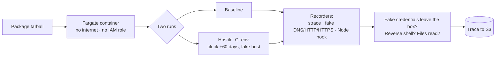
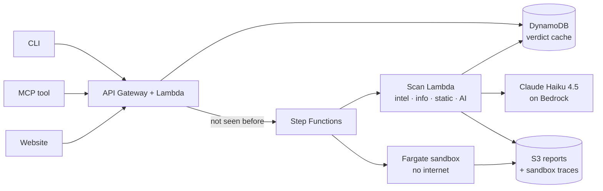

<div align="center">

# 🛡️ PkgGuard

## Your system is compromised, and you don't even know it.

**Every `npm install` runs code written by strangers. PkgGuard reads it, runs it in a cage, and tells you the truth *before* it touches your machine.**

[](https://www.npmjs.com/package/pkgguard-cli)
[](https://www.npmjs.com/package/pkgguard-mcp)
[](https://main.d37i3n9ev8lsz3.amplifyapp.com)


</div>

---

## 😱 The problem

You ask for one package. npm gives you **hundreds**, and any of them can run code on your laptop the moment you install.

| Year | What happened |
|---|---|
| 2018 | `event-stream`: a trusted package was handed to a stranger who added a wallet stealer |
| 2021 | `ua-parser-js` (millions of downloads): hijacked, shipped a password stealer and a miner |
| 2022 | `colors` and `faker`: their own author sabotaged them, breaking thousands of apps |
| 2025 | *Shai-Hulud*: a worm that stole tokens and republished itself into more packages |

Now add **AI coding agents** that run `npm install` on their own, all day, with your credentials in the environment. Nobody is reading those packages.

## ✅ What PkgGuard does

Before a package is installed, PkgGuard runs **five checks** and returns one verdict: `SAFE`, `SUSPICIOUS` or `MALICIOUS`, with the evidence.

| # | Check | In plain words |
|---|---|---|
| 1 | **Threat intel** | Is this already known malware? (OSV.dev, SafeDep) |
| 2 | **Package info** | Install scripts? Brand new? Owner just changed? Publishing setup? |
| 3 | **Static scan** | Read the code without running it (tree-sitter + YARA): stealing secrets, hidden `eval`, reverse shells |
| 4 | **Sandbox** ⭐ | **Run it** in a locked box with no internet and fake passwords, and watch what it does |
| 5 | **AI review** | Claude reads the evidence and the risky code and explains its call |

**The sandbox is the point.** Reading code can be fooled by obfuscation. Running it can't: if a package tries to send our *fake* AWS key to a stranger's server, that's proof, not a guess.

---

## 🚀 Use it in 10 seconds

### 💻 CLI: put it in front of any install

```bash
npx pkgguard-cli install express
```

No account, no key, no setup. Malicious is blocked, suspicious asks first, clean installs, with the exact versions that were checked.

<div align="center">

</div>

```bash
npx pkgguard-cli check lodash              # check one package, install nothing
npx pkgguard-cli install express --deep    # also check every dependency
```

Exit codes for scripts and CI: `0` fine · `1` needs a look · `2` blocked · `3` couldn't finish.

### 🤖 MCP: give your AI agent a check it can't skip

```bash
claude mcp add pkgguard -- npx -y pkgguard-mcp@0.1.1
```

Then just work as usual. Before your agent installs anything, it asks PkgGuard first.

<div align="center">

</div>

Works with Claude Code, Cursor and any MCP client.

### 🌐 Website

**[main.d37i3n9ev8lsz3.amplifyapp.com](https://main.d37i3n9ev8lsz3.amplifyapp.com)**: search any package, see the verdict, the evidence, and exactly what the sandbox saw.

---

## 🔬 The sandbox, and why it's safe to run malware in

Malware is only ever run **in AWS**, never on a laptop.



- **No way out.** The container sits in a VPC with no internet gateway. DNS is allow-listed, and everything else goes to a fake internet that answers and records.
- **Bait.** Fake npm/GitHub/AWS/OpenAI tokens and decoy files (`~/.ssh`, `~/.aws`) are planted. If they show up in outgoing traffic, even encoded, it's proof of theft.
- **Tricks handled.** The second run fakes CI and jumps the clock 60 days, so time-bomb and CI-only malware wake up.
- **No keys inside.** The task has no AWS role at all. It gets one-time upload links instead, so a package can't reach anything of ours. A 22-check escape test runs against the real setup.

---

## 📊 Does it work?

We ran PkgGuard on real malware from [Datadog's public dataset](https://github.com/DataDog/malicious-software-packages-dataset) and on ordinary clean packages, **with threat-intel lookups switched off**, so the numbers measure our own layers, not a lookup table.

| | Result |
|---|---|
| Real malware flagged (suspicious or malicious) | **84 / 100** (77 called malicious) |
| Clean packages correctly marked safe | **184 / 198 (93%)** |
| Verdicts decided by *sandbox proof* | 10 on malware, **0 on clean packages** (no false proofs) |
| Cost of the AI review | about **$0.04 per package** |

**Honest reading.** Several dataset "malware" entries are empty placeholders that no tool could catch, so on packages with real code the flag rate is 85%. Most of our false alarms are legitimate tools that read credentials or run dynamic code (database CLIs, bundlers). We show them as *suspicious*, not *malicious*, so a person can look. Known misses and fixes are tracked openly below.

---

## 🏗️ How it's built



A package is scanned **once**, then served from cache to everyone, so the first person pays the wait and everyone after gets an instant answer.

| Layer | Tech |
|---|---|
| Scanner | Python 3.12 · tree-sitter · YARA · Strands agents · Claude Haiku 4.5 (Bedrock) |
| Sandbox | Docker on AWS Fargate (ARM64) · strace · fake DNS/HTTP/HTTPS · Node hook |
| Backend | AWS SAM: API Gateway · Lambda (container images) · Step Functions · DynamoDB · S3 |
| Website | Next.js · TypeScript · Tailwind · AWS Amplify |
| CLI / MCP | TypeScript · Commander · official MCP SDK (published on npm) |

## 📁 What's in this repo

| Folder | What it is |
|---|---|
| [`analyzer/`](analyzer) | The scanner: metadata checks, static rules, sandbox analysis, AI review, scoring, cloud handlers |
| [`sandbox/`](sandbox) | The container image, the supervisor, the fake internet, and harmless test fixtures |
| [`infra/`](infra) | The whole AWS stack as one SAM template |
| [`cli/`](cli) · [`mcp/`](mcp) | The two published tools |
| [`web/`](web) | The website |
| [`schema/`](schema) | The data contract shared by everything, with real examples |
| [`eval/`](eval) | Harmless fixtures and the evaluation runs |

## 🧪 Run it locally

```bash
cd analyzer && uv sync
uv run analyze express@4.18.2        # scan one package on your machine (reads it, never runs it)
uv run pytest -q                     # 298 tests
cd ../cli && npm install && npm test # 45 tests
cd ../mcp && npm install && npm test # 24 tests
```

Real malware is never run locally, only inside the AWS sandbox.

## ⚠️ Honest limits, and what's next

- A `SAFE` verdict means *no issues found*, not a guarantee.
- Packages that hide their payload until a very specific date or machine can still slip through.
- The AI can miss well-disguised payloads and sometimes over-worries about legitimate tools. The biggest single fix is loosening the rule that stops the AI from clearing a strong static finding.
- Scanning a package nobody has checked takes a minute or two.
- The API is open today. Next: personal API keys with quotas, per-user limits, and pre-scanning the most popular packages so common installs are instant.

---

<div align="center">

**Built for a hackathon. Built because `npm install` shouldn't be an act of faith.**

</div>
